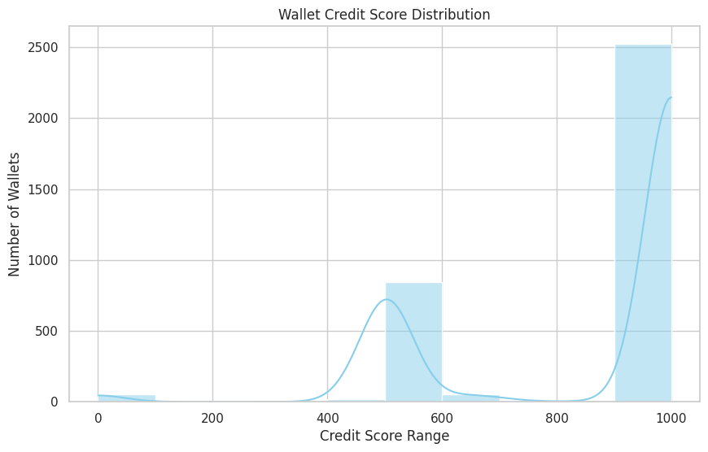

# 📊 Credit Score Analysis

## 🧮 Score Distribution

We plotted a histogram of credit scores for all wallets using Seaborn and Matplotlib.

### 🔹 Distribution Insight:
- Most wallets score between **500 and 1000**
- A significant peak near **1000**, suggesting that many users show **positive DeFi behavior**
- Fewer wallets have extremely low scores

---

## 💡 Behavior of High-Scoring Wallets (800–1000)
- High **repay_ratio** (they repay what they borrow)
- Low **liquidation counts**
- Consistent **active days**
- High **total deposits** and **total repaid**

## ⚠️ Behavior of Low-Scoring Wallets (0–300)
- High **borrow-to-deposit ratios** (borrow more than they deposit)
- Rarely repay loans
- May have been **liquidated** multiple times
- Very low activity (inactive wallets)

---

## 📌 Conclusion

This credit scoring model effectively separates responsible and risky DeFi users. It can be extended for real-time credit evaluation or fraud detection in DeFi protocols.
